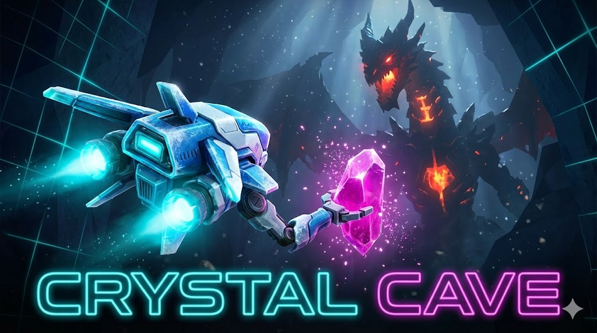

# Crystal Cave: Dragon's Lair 💎🐉

> **Survive the Heat. Master the Drift. Reclaim the Light.**

A procedurally generated, physics-based survival maze game built with React, TypeScript, and Vite, deployable to Cloudflare Workers.

## 🎮 Overview

**Crystal Cave: Dragon's Lair** is an infinite arcade survival game where players pilot a Frost Sentinel drone through a neon-soaked, shifting labyrinth. The goal is to collect energy shards, avoid phasing Fire Dragons, and locate the Warp Portal to descend deeper into the abyss.

The game features a unique **inertial drift movement system**, requiring players to master momentum rather than simple grid-based inputs.

## ✨ Key Features

- **🚀 Physics-Based Drift**: Custom movement engine with acceleration, friction, and wall-sliding collision response.
- **♾️ Procedural Generation**: Infinite levels generated using a Depth-First Search (DFS) maze algorithm. Maps grow in size and complexity as you progress.
- **🧠 Dynamic AI**: Dragons use a Finite State Machine (Spawn -> Idle -> Charge -> Attack -> Despawn) with telegraphing mechanics (warning cones) for fair but challenging combat.
- **🎧 Procedural Audio**: A custom `SoundEngine` class synthesizes all sound effects (echoing roars, musical chimes, ambient drones) in real-time using the Web Audio API. No MP3/WAV assets required.
- **💾 Persistence**: High scores, max levels, and best speedrun times are saved locally via `localStorage`.
- **🎨 2.5D Aesthetics**: Parallax dust particles, glowing bloom effects, and dynamic lighting create a sense of depth on a 2D canvas.
- **⌨️ Keyboard Support**: Arrow keys and WASD for desktop players.
- **📱 Touch Support**: Touch and drag joystick controls for mobile players.

## 🕹️ Controls

The game supports both **Touch/Mouse** and **Keyboard** input.

| Action | Touch/Mouse | Keyboard |
| :--- | :--- | :--- |
| **Move** | Click/Touch and drag anywhere | Arrow keys or WASD |
| **Stop** | Release to let friction take over | Release keys |
| **Pause** | Tap pause button (HUD) | Escape key |
| **Objective** | Follow the **Blue Chevron Arrow** to find the exit portal |

## 🎮 How to Play

### Option 1: Play Online
Visit the deployed Cloudflare Worker URL.

### Option 2: Run Locally
1. Clone the repository
2. Install dependencies:
   ```bash
   npm install
   ```
3. Start the development server:
   ```bash
   npm run dev
   ```
4. Open the URL shown in the terminal (usually http://localhost:5173)


## 🛠️ Development

### Prerequisites
- Node.js (v18+)
- npm

### Project Structure
```
crystal-cave/
├── src/
│   ├── game/                    # Game Logic (TypeScript)
│   │   ├── core/
│   │   │   ├── constants.ts     # Game configuration constants
│   │   │   └── state.ts         # Type definitions and state interfaces
│   │   ├── entities/
│   │   │   ├── Cell.ts          # Maze cell entity
│   │   │   ├── Dragon.ts        # Dragon enemy entity
│   │   │   └── Particle.ts      # Particle effects entity
│   │   ├── systems/
│   │   │   ├── DataManager.ts   # localStorage persistence
│   │   │   ├── MazeGenerator.ts # Procedural maze generation
│   │   │   ├── Renderer.ts      # Canvas rendering system
│   │   │   └── SoundEngine.ts   # Web Audio API sound synthesis
│   │   ├── ui/
│   │   │   └── QuirkyMessages.ts # Toast notification system
│   │   ├── utils/
│   │   │   └── helpers.ts       # Utility functions
│   │   └── GameEngine.ts        # Main game loop and logic
│   ├── App.tsx                  # React component (UI overlay)
│   ├── main.tsx                 # Application entry point
│   └── index.css                # Global styles
├── tests/
│   └── e2e/                     # Playwright E2E tests
├── playwright.config.ts         # Playwright test configuration
├── vite.config.ts               # Vite build configuration
├── tsconfig.json                # TypeScript configuration
└── wrangler.jsonc               # Cloudflare Workers configuration
```

### Build Commands
| Command | Description |
|---------|-------------|
| `npm run dev` | Start local development server |
| `npm run build` | Build for production |
| `npm run preview` | Build and preview production build |
| `npm run deploy` | Deploy to Cloudflare Workers |
| `npm run test:e2e` | Run Playwright E2E tests |
| `npm run test:e2e:ui` | Run tests with Playwright UI |
| `npm run lint` | Run ESLint |


## 🛠️ Technical Deep Dive

For developers interested in how this works under the hood:

### 1. The Game Loop
The game uses a standard `requestAnimationFrame` loop. It separates logic into `update()` (physics, AI, collision) and `draw()` (rendering to HTML5 Canvas).

### 2. Architecture
- **GameEngine Class**: Central game loop managing state, entities, and game logic with proper cleanup for React StrictMode compatibility.
- **Renderer Module**: Functional rendering system with canvas context management and camera transforms.
- **SoundEngine Class**: A wrapper for the AudioContext graph. It routes oscillators through gain nodes and a stereo delay line to create the cave's "echo" atmosphere.
- **VoiceManager Class**: Singleton handling Web Speech API interactions for quirky messages with pitch/rate variation.
- **DataManager Class**: Handles serialization and deserialization of player stats to `localStorage` with quota exceeded handling.
- **Dragon Entities**: Implements a simple AI state machine with **3 distinct types** (Fire, Ice, Lightning) featuring unique stats and behaviors.
    - *Spawning*: Visual warning before hitbox activation.
    - *Idle*: Waits for player proximity.
    - *Charging*: Locks rotation and displays attack vector (Warning Cone).
    - *Attacking*: Instantiates Particle objects with velocity vectors (Single or Spread pattern).
- **MazeGenerator**: Uses a recursive backtracker (DFS) to ensure a perfect maze (no loops, fully connected) is generated every level.

### 3. Rendering Tricks
- **Bloom**: Achieved by layering drawing operations with `shadowBlur` and `shadowColor` properties on the 2D context.
- **Parallax**: Dust particles are rendered in world space but wrap around the camera view, creating an infinite background effect without heavy resource usage.
- **Global Alpha Management**: Proper save/restore of canvas state to prevent rendering artifacts.
- **Frame-Rate Independence**: All physics and animations use delta-time scaling to ensure consistent speed across devices (60Hz vs 120Hz).

## 🔒 Security & Quality

- **Content Security Policy (CSP)**: Comprehensive security headers protect against XSS, clickjacking, and other injection attacks
- **Robust Error Handling**: Game loop error boundaries prevent crashes, localStorage operations handle quota exceeded gracefully
- **AudioContext Management**: Proper handling of browser autoplay policies with fallback mechanisms
- **Performance Optimizations**: Canvas rendering optimizations, particle array safety limits to prevent memory leaks
- **XSS Protection**: All dynamic content uses `.innerText` instead of `.innerHTML` for safe rendering
- **E2E Testing**: Comprehensive Playwright test suite covering gameplay, navigation, and visual consistency across dev and production builds

## 🧪 Testing

The project includes comprehensive E2E tests using Playwright:

```bash
# Run all tests
npm run test:e2e

# Run tests with UI
npm run test:e2e:ui

# Run tests against both dev and preview modes
npx playwright test --project=dev
npx playwright test --project=preview
```

Tests cover:
- Game initialization and rendering
- Navigation between screens (Home, About, Stats, Pause)
- Player movement and controls (keyboard and touch)
- HUD display and updates
- Visual consistency between development and production builds

## � Strategic Roadmap

### Phase 1: "Juice" & Polish (Immediate)
*Focus: Making the current game feel professional.*
- [ ] **Visual Feedback**: Screen shake on impact, flash effects, hit stop (freeze frames), and dynamic camera (look-ahead).
- [ ] **Particles & Lighting**: Post-processing bloom/glow, physical debris from walls, and smooth ribbon trails.
- [ ] **UI Animation**: Animated score counters and smooth level transitions.

### Phase 2: "The Hook" (Retention)
*Focus: Giving players a reason to return.*
- [ ] **Persistence**: Save currency (Gold/Crystals) and unlockables.
- [ ] **Upgrade Shop**: Permanent upgrades (Lives, Speed, Magnet) and consumables.
- [ ] **Unlockables**: New ship skins (Stealth, Tank) and trail effects (Rainbow, Fire).
- [ ] **Achievements**: "Dragon Slayer", "Hoarder", etc.

### Phase 3: Content & Variety
*Focus: Removing repetition.*
- [ ] **Biomes**: Visual themes for deeper levels (Crystal Caverns, Magma Core, Void Expanse).
- [ ] **Power-ups**: Shield, Time Freeze, Magnet, and Radar spawns.
- [ ] **Map Variety**: Traps (spikes, lava) and interactive elements (teleporters).
- [ ] **New Enemies**: Stationary Turrets and Ghost Dragons.

### Phase 4: Audio & Immersion
- [ ] **Dynamic Music**: Layered tracks that react to gameplay intensity.
- [ ] **Spatial Audio**: Directional sound effects for enemies.
- [ ] **Voice Acting**: Stylized character voices.

### Technical Goals
- [ ] **PWA / Mobile App**: Wrap with CapacitorJS for App Store deployment.
- [ ] **Haptics**: Vibration feedback for mobile.
- [ ] **Gamepad Support**: Full controller integration.

## 📄 License

This project is licensed under the MIT License - see the [LICENSE](LICENSE) file for details.
